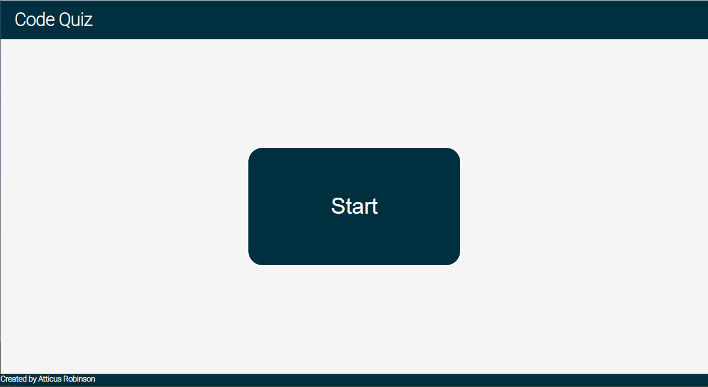
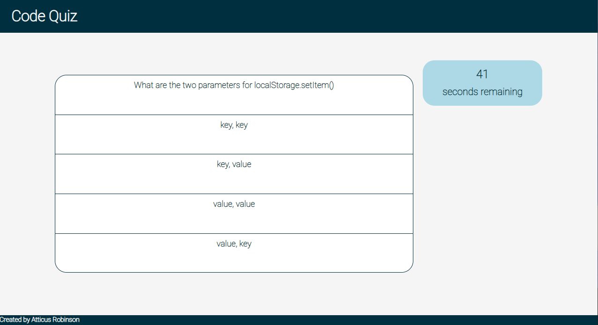
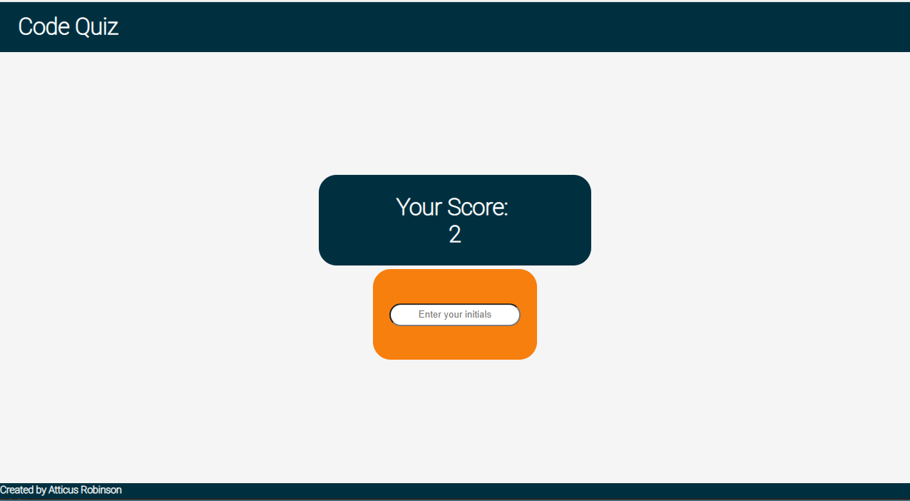

# JavaScript Code Quiz

## Purpose 

The purpose of this quiz is to demonstrate dynamic creation of HTML elements through DOM

## Challenges

I struggled a lot with DOM at the beggining of this challenge, and even still. My main issue was and is event handling. I still haven't grasped how to create functional and specific event handlers.

## Function Flow/Structure

1. startButton();
2. onClick();
    - removeItems();
        - remove();
    - timerBox();
        - countdown();
    - createQA();
        - pullA();
        - shuffleA();
    - checkAnswer();
        - removeItems();
        - createQA();
        - endGame();
            - removeItems();
            - scoreDisplay();
            - nameEntry();
                - keyup event
                    - storeScore();
                    - checkScores();
                        - removeItems();
                    - startButton();

## Deplyed Page

https://atticus-robinson.github.io/code-quiz/

## Page Images

